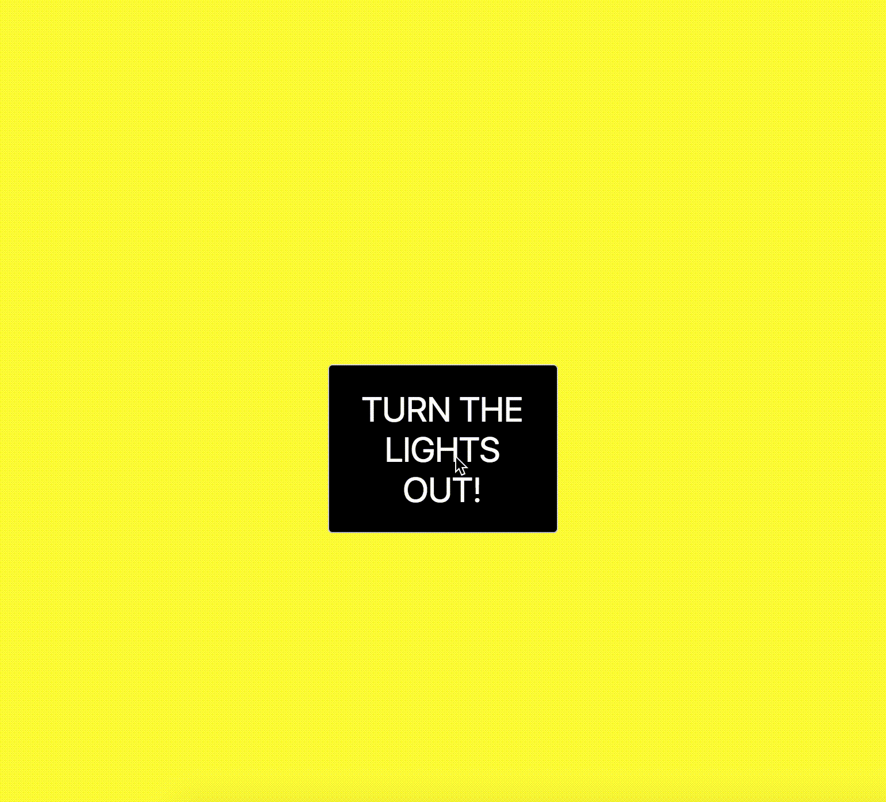

# Turn the lights out

##### Your goal is to make the page do this:

### HTML/CSS
- Change the background color of the body to yellow
- Change the color of the word "BOO!" to yellow

### In `script.js`

###### *Hint* you will need to use:

* jQuery's `.click()` function: https://www.w3schools.com/jquery/event_click.asp
* jQuery's `.css()` function: https://www.w3schools.com/jquery/jquery_css.asp